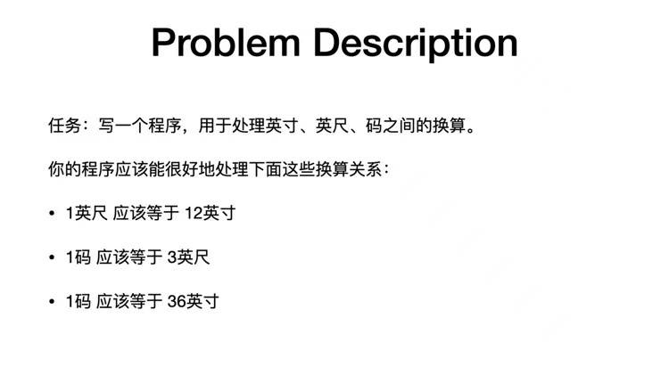

# interview 这个项目主要是个人面试时的遇到的一些编程题。
我认真写完了一个单位换算的Demo.代码在com/highsoft/homework/two下面。原题是：

当然附加条件是：
提交的代码必须完整可运行，并在提交的作业中包含运行代码的方法。如果你使用TDD（测试驱动开发）来完成作业，那么将会大幅提升你的竞争力。注意，此作业不是算法题，请尽量以日常工作中方式解决问题，把每一份作业当作产品经理、BA或者客户需要你完成的一个个功能。