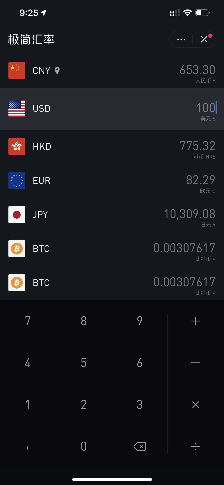
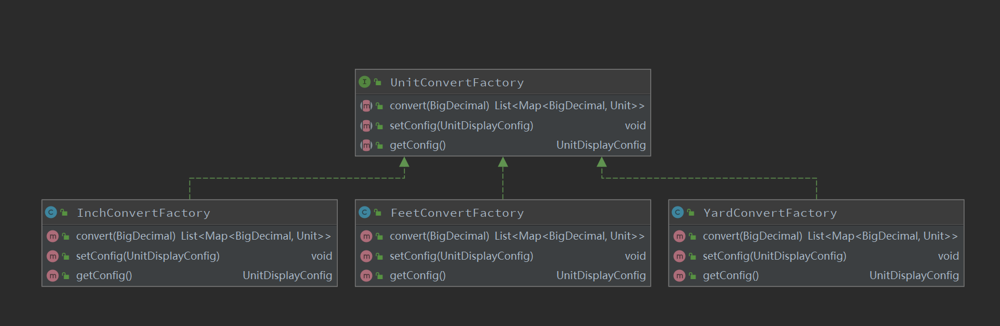

# interview 这个项目主要是个人面试时的遇到的一些编程题。
### Homework one 我第一眼看上去就是我以前写的一个算法题，因为熟悉所以我选择把时间和精力去编写 第二个和第三个作业。

### Homework two 花的时间比较长，主要是代码的结构层优化，一步步抽取代码，向代码可读性，可扩展性，可靠性靠拢，并努力达到优雅。
代码在com/highsoft/homework/two下面。原题是：

我参照的是“项目原型”是：(下面的一个汇率换算界面)当然我没有写界面层代码，不过UnitConvertorAppTest可以算是接口调用的测试。

最后还有一张截图是，工厂类的类图：

### Homework three 这个例子完全参照TDD的实践来一步步编码完成的。
具体的代码在com/highsoft/homework/three.  Homework two 的文档和代码结构都比较清晰，Homework three也基本上是这样结构，同时结构更简单，
所以我就没有编写更多的文档注释。